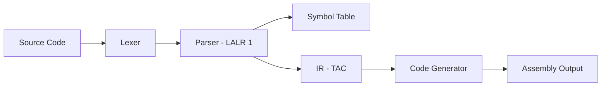

# ⚡ Mini Compiler

<div align="center">


-orange?style=for-the-badge)


**A modern, VS Code-styled compiler with full syntax highlighting and real-time compilation**

[Features](#-features) • [Installation](#-installation) • [Usage](#-usage) • [Architecture](#-architecture) • [Screenshots](#-screenshots)

</div>

---

## ✨ Features

### 🎨 Modern VS Code Interface

- **Dark Theme** — Beautiful Dracula-inspired color scheme
- **Syntax Highlighting** — Real-time code coloring for keywords, operators, comments, and more
- **Split View** — Side-by-side editor and output panels
- **Smart Tab System** — 7 output tabs: Tokens · Syntax · Symbols · Semantic · IR · Assembly · Problems
- **Code Snippets** — 10 built-in example programs (Factorial, FizzBuzz, Bubble Sort, …)

### 🔧 Compiler Capabilities

| Phase | Description |
|-------|-------------|
| **Lexical Analysis** | Tokenizes source code; handles keywords, identifiers, literals, and comments |
| **Syntax Parsing** | LALR(1) parser (PLY yacc); builds AST and reports errors with recovery |
| **Symbol Table** | Nested-scope stack; tracks type, value, scope level, and address |
| **Semantic Analysis** | Checks undeclared variables, duplicate declarations, type compatibility |
| **IR Generation** | Emits three-address code (TAC) instructions during parsing |
| **Assembly Output** | Translates TAC to pseudo-x86 NASM assembly |
| **LL(1) Grammar Tool** | Standalone tool: left-recursion removal, left factoring, FIRST/FOLLOW, parsing table |

### 💡 Developer Experience

- **File Management** — Open / Save with `Ctrl+O` / `Ctrl+S`
- **Line Numbers** — Auto-updating gutter
- **Modified Indicator** — Visual feedback for unsaved changes
- **Status Bar** — Real-time compilation status updates
- **LL(1) Window** — Separate floating window for grammar transformation experiments

---

## 🚀 Installation

### Prerequisites

```
Python 3.8 or higher
tkinter  (bundled with most Python distributions)
PLY      (pip install ply)
```

### Setup

```bash
# Clone the repository
git clone https://github.com/yourusername/mini-compiler.git
cd mini-compiler

# Install dependencies
pip install ply

# Run the compiler
python main.py
```

> **Note:** `requirements.txt` lists the full development environment.
> The only runtime dependency is **`ply`**.

---

## 📖 Usage

### Starting the Compiler

```bash
python main.py
```

### Basic Workflow

1. **Write Code** — Use the left editor panel with live syntax highlighting
2. **Click Run ▶** — Compile your code (or press `F5`)
3. **View Results** — Check outputs in the tabbed panel:
   - **Tokens** — Lexical analysis results
   - **Syntax** — Fired grammar rules, AST, and parse stats
   - **Symbols** — Variable and scope information
   - **Semantic** — Semantic check results
   - **IR Code** — Three-address intermediate representation
   - **Assembly** — Generated pseudo-x86 assembly
   - **Problems** — All errors and warnings

### Supported Syntax

```c
// Variable declarations
int x;
float y = 3.14;

// Assignments
x = 10;

// Arithmetic (all five operators)
int a;
a = (x * 3 + 2) / 4 % 5;

// Output
print(a);

// Conditionals
if (x < y) {
    int diff;
    diff = y - x;
    print(diff);
} else {
    print(x);
}

// Loops
int counter;
counter = 0;
while (counter < 5) {
    print(counter);
    counter = counter + 1;
}

// Comments
// Single line comment
/* Multi-line
   comment */
```

---

## 🏗️ Architecture

### Project Structure

```
mini-compiler/
├── main.py                  # Entry point
├── ui/
│   └── gui.py               # VS Code-styled GUI (CompilerInterface, LL1Window)
├── src/
│   ├── lexer.py             # Lexical analyser    — TokenScanner  (PLY lex)
│   ├── parser.py            # Syntax analyser     — SyntaxProcessor (PLY yacc + TAC emitter)
│   ├── syntax_analysis.py   # Syntax result builder — AST view & stats
│   ├── symbol_table.py      # Symbol table        — VariableRegistry (nested scope stack)
│   ├── semantic.py          # Semantic checks     — semantic_analysis()
│   ├── code_generator.py    # Code generator      — AssemblyTranslator (TAC → pseudo-x86)
│   ├── grammar_utils.py     # LL(1) utilities     — FIRST/FOLLOW, parsing table, formatters
│   ├── grammar_tool.py      # LL(1) CLI           — interactive terminal interface
│   └── parsetab.py          # Auto-generated PLY parse table (do not edit)
├── tests/
│   └── test_cases.c         # Sample test programs
├── .gitignore
└── requirements.txt
```

### Compilation Pipeline



### Components

| Component | Class / Module | Description |
|-----------|---------------|-------------|
| **TokenScanner** | `lexer.py` | Breaks source code into tokens |
| **SyntaxProcessor** | `parser.py` | LALR(1) parser; emits TAC IR |
| **VariableRegistry** | `symbol_table.py` | Nested-scope symbol table |
| **semantic_analysis** | `semantic.py` | Semantic validation layer |
| **AssemblyTranslator** | `code_generator.py` | Converts IR to pseudo-x86 |
| **LL(1) Utilities** | `grammar_utils.py` | Grammar transformation toolkit |

---

## 📸 Screenshots

### Main Interface


*VS Code-styled editor with syntax highlighting and split-panel output*

### Compilation Results


*Detailed token analysis, symbol table, IR code, and assembly output*

---

## 🎯 Syntax Highlighting Colors

### Code Editor

| Element | Color |
|---------|-------|
| Keywords (`int`, `if`, `while`) | `#FF7B72` Red-orange |
| Numbers (`10`, `3.14`) | `#BC8CFF` Purple |
| Comments (`//`, `/* */`) | `#484F58` Grey italic |
| Operators (`+`, `-`, `*`) | `#FF7B72` Red-orange |
| Functions (`print`) | `#3FB950` Green bold |
| Variables | `#C9D1D9` Light grey |

### Output Panels

| Element | Color |
|---------|-------|
| Instructions | `#8BE9FD` Cyan |
| Registers | `#FFB86C` Orange |
| Labels | `#F1FA8C` Yellow |
| Errors | `#FF5555` Red |
| Success | `#50FA7B` Green |

---

## ⌨️ Keyboard Shortcuts

| Shortcut | Action |
|----------|--------|
| `Ctrl + S` | Save file |
| `Ctrl + O` | Open file |
| `F5` | Run compilation |

---

## 🛠️ Technologies Used

| Technology | Purpose |
|------------|---------|
| **Python 3.8+** | Core language |
| **Tkinter** | GUI framework |
| **PLY 3.11** | Lexer (`lex`) and LALR(1) parser (`yacc`) |
| **`re` module** | Syntax highlighting pattern matching |

---

## 👨‍💻 Author

**Abdullah Al-Mamun**

Built with ❤️ for compiler design final lab project

---

<div align="center">

**⭐ Star this repo if you find it helpful!**

Made with Python · PLY · Tkinter

</div>
